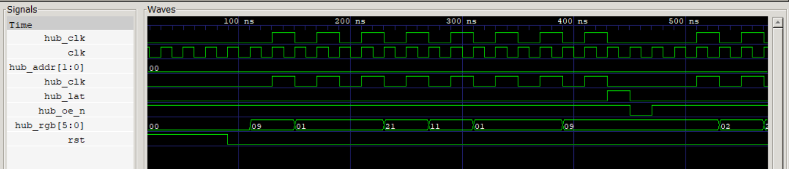
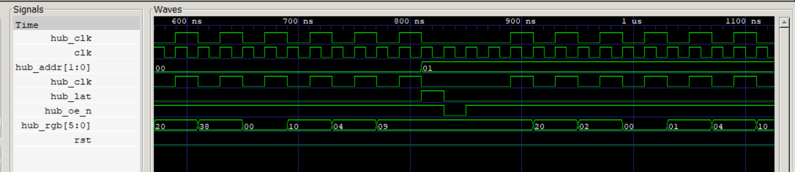
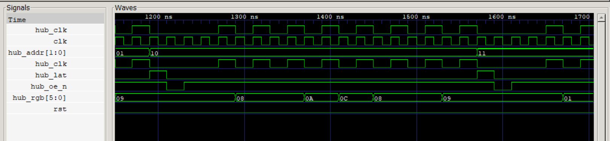
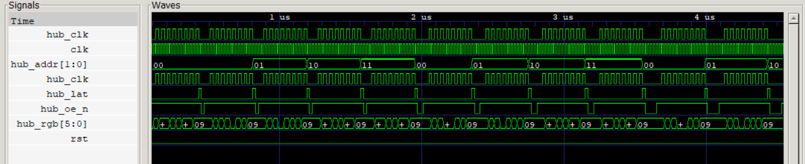

# HUB75 RGB LED Matrix Driver

A parameterised **HUB75 RGB-LED-matrix controller** for the Shrike-fi (Renesas
SLG47910V ForgeFPGA). One ForgeFPGA drives one panel. Defaults to an **8×8**
panel and is parameterised for other sizes; colour is produced by
**Binary-Code-Modulation (BCM)**, default **4 bits per channel (4096 colours)**.

**Boards:** Shrike / Shrike-Lite / Shrike-fi (FPGA fabric only)
**Uses FPGA:** ✅ &nbsp; **Uses MCU:** – &nbsp; **External hardware:** none

> ### ⚠️ Simulation-only project
> This project is designed and **fully verified in simulation** — a self-checking
> testbench acts as a virtual HUB75 panel, watches the driver's output pins,
> rebuilds the displayed frame, and checks it against the source image
> (`RESULT: PASS`). The RTL is written to be synthesisable and a pin-mapping
> guide is included ([`PINOUT.md`](PINOUT.md)), but it has **not** been built to
> a bitstream or run on a physical panel. No bitstream/firmware is included.

## What it does

Continuously redraws a HUB75 panel: splits it into an upper and lower half,
scans one row of each half at a time, shifts the pixels in on `hub_clk`, latches
them, and lights the row for a bit-plane-weighted time. Over one frame the
per-channel on-time equals its value, giving 4096 colours from on/off LEDs.

## Run it (simulation)

Requires [Icarus Verilog](http://iverilog.icarus.com/) (`iverilog` + `vvp`);
optionally [GTKWave](https://gtkwave.sourceforge.net/) for waveforms.

```bash
cd ffpga/sim
make                       # Linux/macOS/Git-Bash
# or on Windows PowerShell:
powershell -File run_sim.ps1
```

Expected output — the recovered picture matches the source image exactly:

```
--- ASCII (dominant colour, '.'=off) ---
  RRRRRRRR
  RG....BR
  R.GRRB.R
  R..GB..R
  R..BG..R
  R.BRGG.R
  RB....GR
  RRRRRRRR

RESULT: PASS  (all 64 pixels x 3 channels match)
```

Simulate other sizes by generating a matching image:

```bash
cd ffpga/sim
python gen_image.py 16 16 4 image_16x16.hex
iverilog -g2012 -DP_COLS=16 -DP_ROWS=16 -DP_BPP=4 \
         -DHUB75_SIM_INIT -DHUB75_INIT_FILE='"image_16x16.hex"' \
         -o tb.vvp ../src/main.v tb_hub75.v && vvp tb.vvp
```

Verified passing: **8×8/BPP4**, **16×16/BPP4**, **32×16/BPP2**, **64×32/BPP4**,
**64×64/BPP2**, plus `BPP=1` and `BPP=8`.

## How it works

The design (`ffpga/src/main.v`) is three modules:

1. **`hub75_framebuffer`** — picture memory: `ROWS×COLS` words of `3·BPP` bits
   (`{R,G,B}`), two read ports (upper/lower half). Preloaded from a hex image
   via `$readmemh` in simulation.
2. **`hub75_driver`** — a 3-state machine: **SHIFT** clocks all `COLS` pixels of
   one row into the panel (2 clocks/pixel, blanked); **LATCH** pulses `hub_lat`
   and drives the row address; **DISPLAY** lights the row (`hub_oe_n` low) for
   `DISP_BASE·2^plane` clocks, then advances row/bit-plane.
3. **`hub75_top`** — the pin wrapper (ForgeFPGA rules: `(* top *)`,
   `clkbuf_inhibit` clock, a `_oe` output-enable per pin tied high, `clk_en`).

**BCM colour:** an LED is only on/off, so a shade is made by *time* — bit-plane 0
is shown for 1 clock, plane 1 for 2, plane 2 for 4, plane 3 for 8. Over one frame
the on-time of a channel equals its 0–15 value.

**Self-checking testbench (`ffpga/sim/tb_hub75.v`):** behaves like a real panel —
samples the colour bits on each `hub_clk` rising edge, measures how long
`hub_oe_n` stays low per line (= the bit-plane weight), accumulates `bit × weight`
per pixel over one frame, and compares the recovered values to the source image.

### Parameters (on `hub75_top`)

| Param       | Default | Meaning                                                   |
|-------------|---------|-----------------------------------------------------------|
| `COLS`      | 8       | panel width in pixels (≥ 2)                               |
| `ROWS`      | 8       | panel height in pixels (even, ≥ 4)                        |
| `BPP`       | 4       | colour bits per channel (1–8)                             |
| `DISP_BASE` | 1       | display clocks for the LSB bit-plane (brightness/refresh) |

## Waveforms

Captured in GTKWave from `ffpga/sim/tb_hub75.vcd`:

**Shift + latch of one row** — 8 pixels clocked in on `hub_clk`, then a `hub_lat` pulse.


**Row advance** — `hub_addr` updates at the latch and holds while the next row shifts.


**Row-address scan** — `hub_addr` sweeps `01 → 10 → 11` across the panel.


**Bit-plane wrap** — after the last row, `hub_addr` wraps and `hub_oe_n` lit-time grows.


**Plane-1 scan** — same sweep with a wider `hub_oe_n` lit-time (weight 2).


**Full BCM staircase** — `hub_oe_n` lit-time doubles per bit-plane (1 → 2 → 4 → 8 clocks).


## Layout

```
hub75/
├── README.md          this file
├── PINOUT.md          IO-planner pin mapping (hardware reference; not needed to simulate)
├── ffpga/
│   ├── src/
│   │   ├── main.v         hub75_top + hub75_driver + hub75_framebuffer
│   │   └── spi_target.v   optional ESP32-S3 SPI write path (hardware reference)
│   └── sim/
│       ├── tb_hub75.v     self-checking virtual-panel testbench
│       ├── image_8x8.hex  default 8×8 RGB444 test image
│       ├── gen_image.py   test-image generator for any COLS/ROWS/BPP
│       ├── Makefile       `make` = build + run, `make wave` = view waveform
│       └── run_sim.ps1    Windows PowerShell runner
└── images/            waveform screenshots
```

Taking it to hardware would mean building `ffpga/src/main.v` in Go Configure and
mapping the pins per [`PINOUT.md`](PINOUT.md) — documented, but out of scope for
this simulation-only project.
